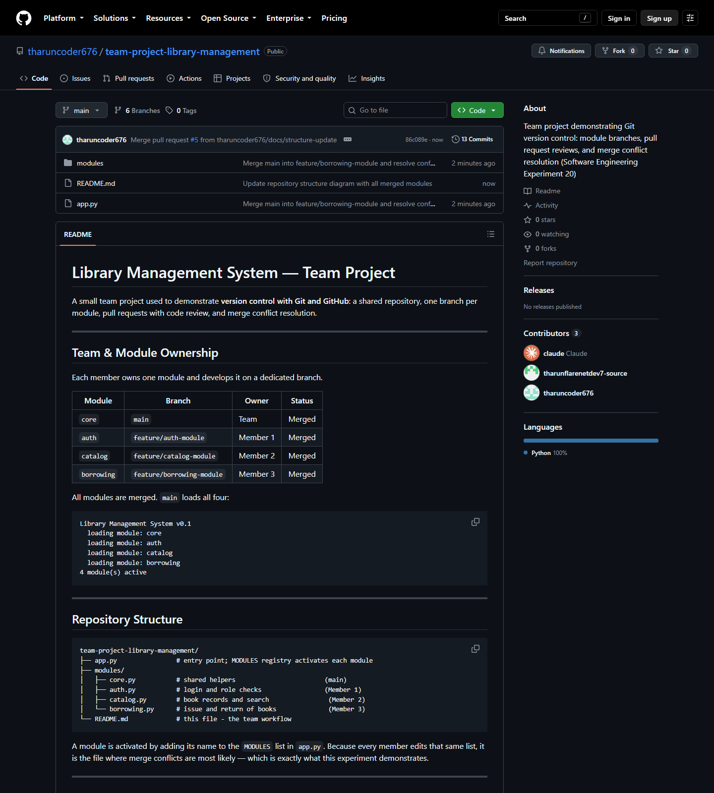

# Experiment 20 — Create a GitHub Repository and Implement Version Control

## Repository Link

**https://github.com/tharuncoder676/team-project-library-management**

---

## Aim

To set up a repository for a team project, develop each module on its own
branch, merge those branches through pull requests after code review, resolve
the conflicts that arise, and document the workflow in the README.

---

## Screenshot



The repository home page showing 6 branches, 13 commits, all four modules
merged, and the workflow documentation in the README.

---

## 1. Repository Set Up for a Team Project

A new public repository — `team-project-library-management` — holds a small
**Library Management System**. Modules are activated by registering their name
in the `MODULES` list in `app.py`:

```python
MODULES = [
    "core",
    "auth",
    "catalog",
    "borrowing",
]
```

Because every member edits that one list, it is the natural conflict point —
which is what makes the experiment realistic.

---

## 2. Branches Created for Individual Modules

| Module | Branch | Owner |
|---|---|---|
| `core` | `main` | Team (baseline) |
| `auth` | `feature/auth-module` | Member 1 |
| `catalog` | `feature/catalog-module` | Member 2 |
| `borrowing` | `feature/borrowing-module` | Member 3 |

All three feature branches were cut from the **same baseline commit**, exactly
as happens when a team starts work in parallel.

```bash
git checkout -b feature/auth-module
git push -u origin feature/auth-module
```

---

## 3. Merged with Pull Requests After Code Review

Five pull requests were opened, reviewed and merged:

| PR | Title | Result |
|---|---|---|
| #1 | Add authentication module | Merged cleanly |
| #2 | Add catalog module | **Conflicted** — resolved, then merged |
| #3 | Add borrowing module | **Conflicted** — resolved, then merged |
| #4 | Update README with final module status | Merged |
| #5 | Update repository structure diagram | Merged |

Every pull request carries a written code review before merging. Example
(PR #1):

> Checked: `login()` returns `None` for unknown users rather than raising, so
> callers can branch on it cleanly. `is_librarian()` reuses `login()` instead of
> touching `USERS` directly — good, single source of truth.

Merge commits were used (not squash) so the branch and conflict history stays
visible in the graph.

---

## 4. Conflicts Resolved During Merging

### Conflict 1 — PR #2 (catalog), after PR #1 merged

`main` had moved on, so `app.py` and `README.md` both conflicted:

```python
MODULES = [
    "core",
<<<<<<< HEAD
    "catalog",
=======
    "auth",
>>>>>>> main
]
```

**Resolved by keeping both entries.** The two modules are independent additions
that only collided because they were written at the same line position —
nothing had to be discarded.

```python
MODULES = [
    "core",
    "auth",
    "catalog",
]
```

### Conflict 2 — PR #3 (borrowing), after PRs #1 and #2 merged

The same conflict one branch later, except the incoming side now carried **two**
already-merged modules against this branch's one:

```python
<<<<<<< HEAD
    "borrowing",
=======
    "auth",
    "catalog",
>>>>>>> main
```

**Resolved by keeping all three**, appending `borrowing` after the two already
on `main`.

### Resolution procedure

```bash
git checkout main
git pull origin main
git checkout feature/catalog-module
git merge main                      # -> CONFLICT
# edit files, delete the conflict markers
grep -rn "<<<<<<<|>>>>>>>" .        # verify none remain
python app.py                       # verify the merged code runs
git add app.py README.md            # staging marks the conflict RESOLVED
git commit
git push origin feature/catalog-module
```

**Lesson recorded in the project README:** all three branches were cut from the
same commit and touched the same two lines, which is why conflicts 1 and 2 were
nearly identical. Merging `main` into each branch *early and often* would have
kept each conflict to a single line.

---

## 5. Workflow Documented in the README

The project README documents the team rules:

1. **Never commit directly to `main`** — all work arrives through a pull request.
2. **One branch per module**, named `feature/<module>-module`.
3. **Pull `main` before merging** so conflicts surface locally, not on GitHub.
4. **At least one reviewer approves** before a pull request is merged.
5. **Delete the branch after merge** to keep the branch list readable.

Rule 1 was followed even for the two documentation fixes — PRs #4 and #5 were
raised rather than pushed straight to `main`.

The README also contains a **conflict log** table recording both conflicts,
their cause, and how each was settled.

---

## Final Result

`main` loads all four modules:

```
Library Management System v0.1
  loading module: core
  loading module: auth
  loading module: catalog
  loading module: borrowing
4 module(s) active
```

Commit graph, showing the three module merges and two conflict resolutions:

```
*   Merge pull request #4 from docs/final-status
*   Merge pull request #3 from feature/borrowing-module
|\
| *   Merge main into feature/borrowing-module and resolve conflicts
* |   Merge pull request #2 from feature/catalog-module
|\ \
| * \   Merge main into feature/catalog-module and resolve conflicts
* | |   Merge pull request #1 from feature/auth-module
|\ \ \
| * | | Add authentication module with login and role checks
| * / Add catalog module with book records and search
| * Add borrowing module for issuing and returning books
* Initial commit: project scaffold, core module and team workflow README
```

---

## Conclusion

Branch-per-module keeps parallel work isolated, and pull requests provide the
review gate before anything reaches `main`. Conflicts are not errors — they are
Git declining to guess when two people edit the same lines. Git identifies
*where* the disagreement is; deciding *what the code should be* remains the
developer's job. Here both conflicts were "both sides are right" cases, so the
resolution was to keep every contribution rather than choose between them.
