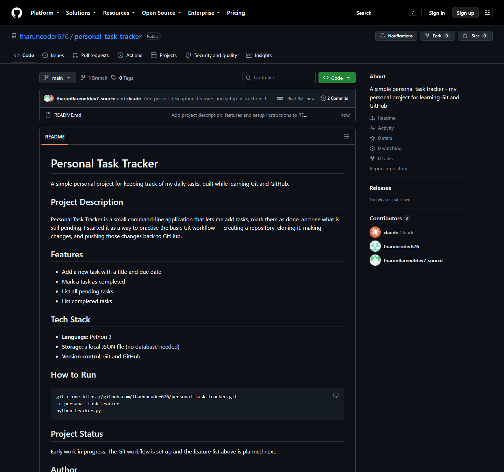

# Experiment 25 — Create a GitHub Repository and Push Changes

## Repository Link

**https://github.com/tharuncoder676/personal-task-tracker**

---

## Aim

To create a new GitHub repository for a personal project, initialize it with a
README.md, clone it locally, edit the README, and push the changes back to
GitHub.

---

## Screenshot



The repository after pushing — **2 commits** (the initial README, then the
edit) and the updated README rendered on the main page.

---

## Steps Performed

### 1. Create a GitHub repository

Created `personal-task-tracker` as a public repository, initialized with a
`README.md`:

```bash
gh repo create personal-task-tracker --public --add-readme
```

The starting README contained just the repository name and description:

```markdown
# personal-task-tracker
A simple personal task tracker - my personal project for learning Git and GitHub
```

### 2. Clone the repository to the local machine

```bash
git clone https://github.com/tharuncoder676/personal-task-tracker.git
cd personal-task-tracker
```

### 3. Edit the README.md file

Expanded the README with a full project description, feature list, tech stack,
setup instructions, project status and author section.

### 4. Stage, commit and push the changes

```bash
git status --short
# M README.md

git add README.md

git commit -m "Add project description, features and setup instructions to README"
# [main 96a1262] Add project description, features and setup instructions to README
#  1 file changed, 41 insertions(+), 2 deletions(-)

git push origin main
# To https://github.com/tharuncoder676/personal-task-tracker.git
#    ede6a65..96a1262  main -> main
```

---

## Commands Used

| Command | Purpose |
|---|---|
| `gh repo create <name> --public --add-readme` | Create the repository with a README |
| `git clone <url>` | Copy the remote repository to the local machine |
| `git status --short` | See which files were modified (`M README.md`) |
| `git add <file>` | Stage the change |
| `git commit -m "message"` | Record the change in local history |
| `git push origin main` | Send the commit to GitHub |

---

## Result

The repository now shows **2 commits** and the expanded README on its main
page, confirming the change was pushed successfully.

---

## Conclusion

This experiment covers the everyday Git cycle: **clone → edit → add → commit →
push**. `git add` stages what will go into the next commit, `git commit` saves
it to local history, and `git push` publishes it to GitHub — three separate
steps, which is what lets you choose exactly what gets shared and when.
