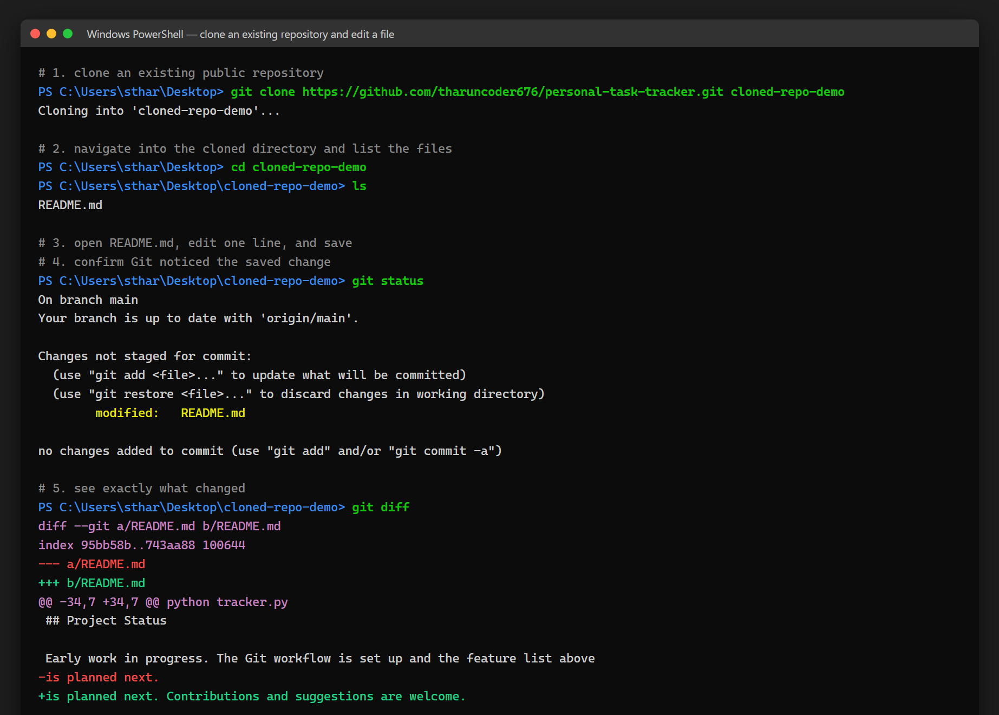

# Experiment 26 — Clone a Repository and Make a Small Change

## Repository Used

**https://github.com/tharuncoder676/personal-task-tracker**

---

## Aim

To clone an existing public GitHub repository to the local machine, open one of
its files, make a small edit, and save the change.

---

## Screenshot



The full session: `git clone`, navigating into the directory, `git status`
showing `modified: README.md`, and `git diff` showing the edited line.

---

## Steps Performed

### 1. Choose an existing public repository

Used my own public repository, `personal-task-tracker`.

### 2. Clone the repository

```bash
git clone https://github.com/tharuncoder676/personal-task-tracker.git cloned-repo-demo
```

```
Cloning into 'cloned-repo-demo'...
```

### 3. Navigate into the directory and open a file

```bash
cd cloned-repo-demo
ls
# README.md
```

Opened `README.md` in the editor.

### 4. Make a small edit

Modified one line in the **Project Status** section:

| | Line |
|---|---|
| Before | `is planned next.` |
| After | `is planned next. Contributions and suggestions are welcome.` |

### 5. Save the changes

After saving, Git detected the modification:

```bash
git status
```

```
On branch main
Your branch is up to date with 'origin/main'.

Changes not staged for commit:
  (use "git add <file>..." to update what will be committed)
  (use "git restore <file>..." to discard changes in working directory)
        modified:   README.md

no changes added to commit (use "git add" and/or "git commit -a")
```

```bash
git diff
```

```diff
diff --git a/README.md b/README.md
index 95bb58b..743aa88 100644
--- a/README.md
+++ b/README.md
@@ -34,7 +34,7 @@ python tracker.py
 ## Project Status

 Early work in progress. The Git workflow is set up and the feature list above
-is planned next.
+is planned next. Contributions and suggestions are welcome.
```

---

## Commands Used

| Command | Purpose |
|---|---|
| `git clone <url> <folder>` | Copy the remote repository to the local machine |
| `cd <folder>` | Navigate into the cloned directory |
| `ls` | List the files in the repository |
| `git status` | Show which files have been modified |
| `git diff` | Show exactly which lines changed |

---

## Conclusion

Cloning downloads the full repository **and its history**, not just the current
files, which is why Git can immediately tell that `README.md` differs from the
version that was cloned.

The change at this point exists **only in the working directory** — `git status`
reports it as "not staged for commit". It is saved on disk but not yet recorded
by Git. Making it part of the project history would need `git add` to stage it
and `git commit` to record it, and `git push` to send it to GitHub. This
experiment stops at the save step, so the file is left modified and uncommitted.
