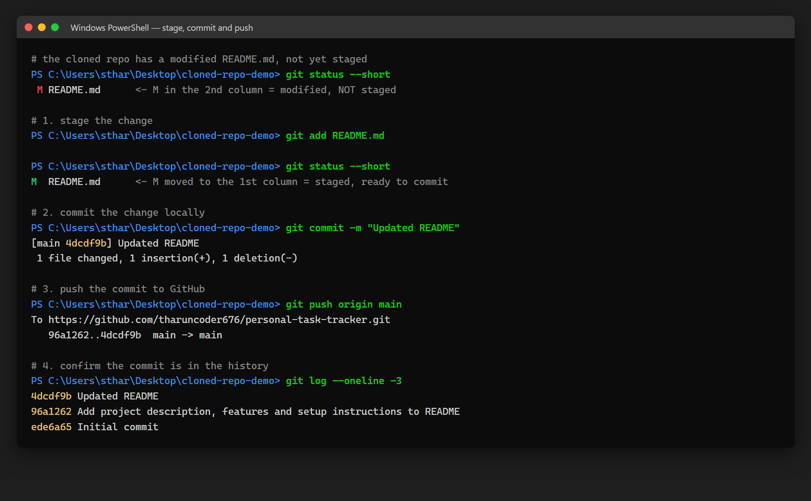

# Experiment 27 — Commit and Push Changes to GitHub

## Repository Used

**https://github.com/tharuncoder676/personal-task-tracker**

---

## Aim

To take the file modified in the cloned repository, stage it, commit it
locally, and push the commit to GitHub.

---

## Screenshot



The full session: `git add` moving the file from unstaged to staged,
`git commit -m "Updated README"`, `git push`, and `git log` confirming the
commit.

---

## Steps Performed

### 1. Clone the repository (from the previous experiment)

The same clone from Experiment 26 was reused, at
`Desktop/cloned-repo-demo`, still holding the modified `README.md`.

### 2. Modify a file

`README.md` had already been edited in Experiment 26:

```diff
-is planned next.
+is planned next. Contributions and suggestions are welcome.
```

Git showed it as modified but not staged:

```bash
git status --short
```

```
 M README.md
```

### 3. Stage the changes with `git add`

```bash
git add README.md
git status --short
```

```
M  README.md
```

Note the `M` moved from the **second** column to the **first**. The first
column is the staging area, the second is the working directory — so the
change is now staged.

### 4. Commit the changes

```bash
git commit -m "Updated README"
```

```
[main 4dcdf9b] Updated README
 1 file changed, 1 insertion(+), 1 deletion(-)
```

### 5. Push the changes to GitHub

```bash
git push origin main
```

```
To https://github.com/tharuncoder676/personal-task-tracker.git
   96a1262..4dcdf9b  main -> main
```

### Confirmation

```bash
git log --oneline -3
```

```
4dcdf9b Updated README
96a1262 Add project description, features and setup instructions to README
ede6a65 Initial commit
```

---

## Commands Used

| Command | Purpose |
|---|---|
| `git status --short` | Check whether a change is staged or not |
| `git add <file>` | Stage the change for the next commit |
| `git commit -m "Updated README"` | Record the staged change in local history |
| `git push origin main` | Send the local commit to GitHub |
| `git log --oneline` | Confirm the commit exists in the history |

---

## Conclusion

The three commands do three different jobs, which is why Git separates them:

- **`git add`** chooses *what* goes into the next commit. Nothing is recorded yet.
- **`git commit`** records those staged changes in the **local** repository.
  At this point the commit exists on the machine only — GitHub still knows
  nothing about it.
- **`git push`** uploads the local commits to GitHub.

The push output `96a1262..4dcdf9b  main -> main` names the range of commits
that travelled: `main` moved from the old commit to the new one.
