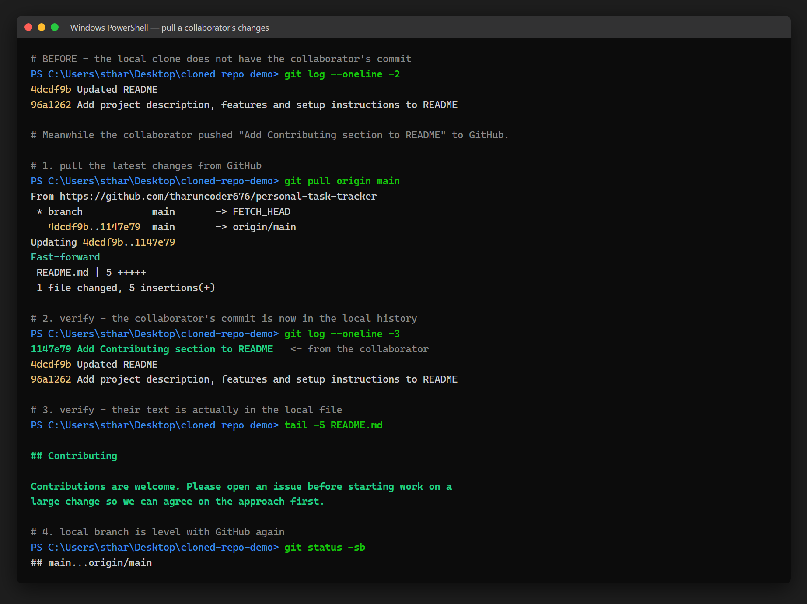

# Experiment 28 — Pull a Collaborator's Changes from GitHub

## Repository Used

**https://github.com/tharuncoder676/personal-task-tracker**

---

## Aim

To pull changes that another collaborator pushed to GitHub into the local
clone, and verify that their work appears locally.

---

## Screenshot



The full session: local history before the pull, `git pull origin main`
fast-forwarding, and the verification that the collaborator's commit and text
are now present locally.

---

## Steps Performed

### 1. Clone a repository (from the previous experiments)

The same clone at `Desktop/cloned-repo-demo` was reused. Before pulling, its
history ended at the commit from Experiment 27:

```bash
git log --oneline -2
```

```
4dcdf9b Updated README
96a1262 Add project description, features and setup instructions to README
```

### 2. A collaborator makes a change and pushes it

The collaborator added a **Contributing** section to `README.md` and committed
it to GitHub:

```
1147e79  Add Contributing section to README
```

At this point GitHub has the commit and the local clone does not.

> **Note:** this project has a single author, so the collaborator's commit was
> made directly on GitHub rather than by a second person. From the local
> clone's point of view this is identical — the commit exists on the remote and
> has to be pulled down.

### 3. Pull the latest changes

```bash
git pull origin main
```

```
From https://github.com/tharuncoder676/personal-task-tracker
 * branch            main       -> FETCH_HEAD
   4dcdf9b..1147e79  main       -> origin/main
Updating 4dcdf9b..1147e79
Fast-forward
 README.md | 5 +++++
 1 file changed, 5 insertions(+)
```

**Fast-forward** means the local branch had no commits of its own to reconcile,
so Git simply moved it forward to the collaborator's commit. No merge commit
was needed.

### 4. Verify the collaborator's changes appear locally

Their commit is now in the local history:

```bash
git log --oneline -3
```

```
1147e79 Add Contributing section to README     <- from the collaborator
4dcdf9b Updated README
96a1262 Add project description, features and setup instructions to README
```

Their text is in the local file:

```bash
tail -5 README.md
```

```markdown
## Contributing

Contributions are welcome. Please open an issue before starting work on a
large change so we can agree on the approach first.
```

And the local branch is level with GitHub again:

```bash
git status -sb
```

```
## main...origin/main
```

(no "ahead" or "behind" marker — the two are in sync)

---

## Commands Used

| Command | Purpose |
|---|---|
| `git log --oneline` | Show the commit history before and after the pull |
| `git pull origin main` | Fetch the latest commits from GitHub and merge them in |
| `tail -5 README.md` | Confirm the collaborator's text is in the local file |
| `git status -sb` | Confirm the local branch is level with the remote |

---

## Conclusion

`git pull` is two operations in one: **`git fetch`**, which downloads the new
commits from GitHub, and **`git merge`**, which brings them into the current
branch.

Here the merge was a **fast-forward** because the local branch had not moved
since the last push — there was nothing to reconcile, so Git just advanced the
branch pointer. Had there been local commits as well, Git would have created a
merge commit instead, and could have reported a conflict if both sides had
edited the same lines.

Pulling before starting new work is the habit that keeps conflicts small.
