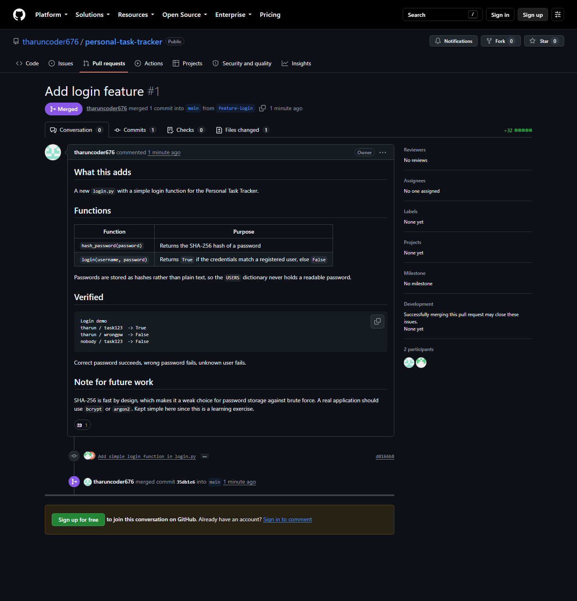

# Experiment 29 — Feature Branch, Login Function and Pull Request

## Repository Used

**https://github.com/tharuncoder676/personal-task-tracker**

**Pull request:** https://github.com/tharuncoder676/personal-task-tracker/pull/1

---

## Aim

To create a `feature-login` branch, implement a simple login function in
`login.py`, push it to GitHub, and merge it into `main` through a pull request.

---

## Screenshot



Pull request #1 with the **Merged** badge — *merged 1 commit into `main` from
`feature-login`*, showing the commit `d0166b8` and the merge commit `35db1e6`.

---

## Steps Performed

### 1. Create the branch `feature-login`

```bash
git checkout -b feature-login
```

```
Switched to a new branch 'feature-login'
```

### 2. Add `login.py` with a simple login function

```python
"""Simple login function for the Personal Task Tracker."""

import hashlib


def hash_password(password):
    """Return the SHA-256 hash of a password."""
    return hashlib.sha256(password.encode()).hexdigest()


# Registered users, stored as username -> hashed password.
USERS = {
    "tharun": hash_password("task123"),
    "guest": hash_password("guest123"),
}


def login(username, password):
    """Check a username and password.

    Returns True if the credentials match a registered user, otherwise False.
    """
    if username not in USERS:
        return False
    return USERS[username] == hash_password(password)
```

The full file is included in this folder as [`login.py`](login.py).

**Tested before committing:**

```
Login demo
tharun / task123  -> True
tharun / wrongpw  -> False
nobody / task123  -> False
```

A correct password succeeds, a wrong password fails, and an unknown user fails.

### 3. Commit and push to GitHub

```bash
git add login.py
git commit -m "Add simple login function in login.py"
```

```
[feature-login d0166b8] Add simple login function in login.py
 1 file changed, 32 insertions(+)
 create mode 100644 login.py
```

```bash
git push -u origin feature-login
```

```
 * [new branch]      feature-login -> feature-login
branch 'feature-login' set up to track 'origin/feature-login'.
```

### 4. Create the pull request and merge it

```bash
gh pr create --base main --head feature-login --title "Add login feature"
gh pr merge 1 --merge
```

Result — PR #1 **MERGED**, merge commit `35db1e6`.

After merging, `main` contains the new file:

```bash
git checkout main
git pull origin main
ls
```

```
README.md
login.py
```

```bash
git log --oneline --graph -4
```

```
*   35db1e6 Merge pull request #1 from tharuncoder676/feature-login
|\
| * d0166b8 Add simple login function in login.py
|/
* 1147e79 Add Contributing section to README
```

---

## Commands Used

| Command | Purpose |
|---|---|
| `git checkout -b feature-login` | Create the feature branch and switch to it |
| `git add login.py` | Stage the new file |
| `git commit -m "..."` | Record the change locally |
| `git push -u origin feature-login` | Publish the branch to GitHub |
| `gh pr create --base main --head feature-login` | Open the pull request |
| `gh pr merge 1 --merge` | Merge the pull request into `main` |

---

## How the Login Function Works

1. `hash_password()` converts a password into a SHA-256 hash — a fixed-length
   string that cannot practically be reversed back into the password.
2. `USERS` stores those hashes, **not** the passwords, so the readable password
   never appears anywhere in the file.
3. `login()` hashes whatever password is supplied and compares it against the
   stored hash. Equal hashes mean the password was correct.
4. An unknown username returns `False` immediately.

**Note on security:** SHA-256 is deliberately *fast*, which makes it a poor
choice for storing passwords — an attacker with the hashes can try billions of
guesses per second. A real application should use a deliberately slow algorithm
such as `bcrypt` or `argon2`, plus a per-user salt. SHA-256 is used here because
the exercise asks for a *simple* login function.

---

## Conclusion

The feature branch workflow keeps new work off `main` until it is finished and
reviewed. The branch is developed and pushed independently, the pull request
provides the place to review the change and discuss it, and only after merging
does the code become part of `main`. The merge commit `35db1e6` records exactly
when and from where the feature arrived.
