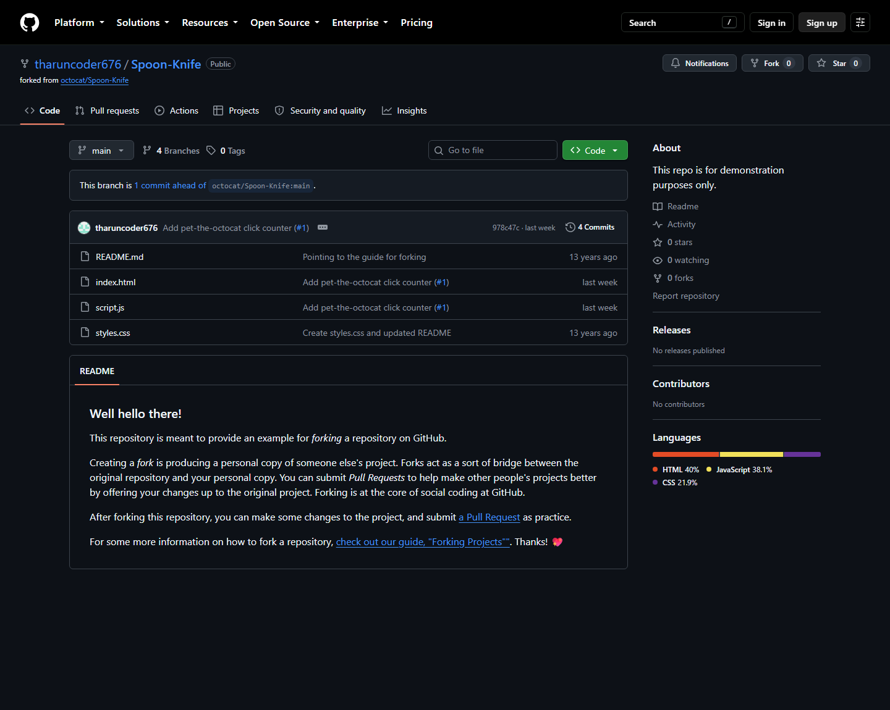
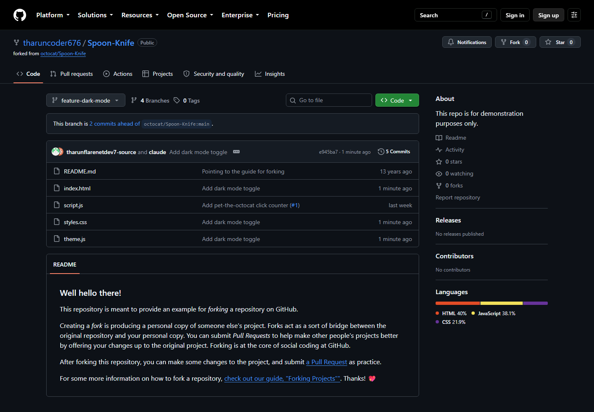
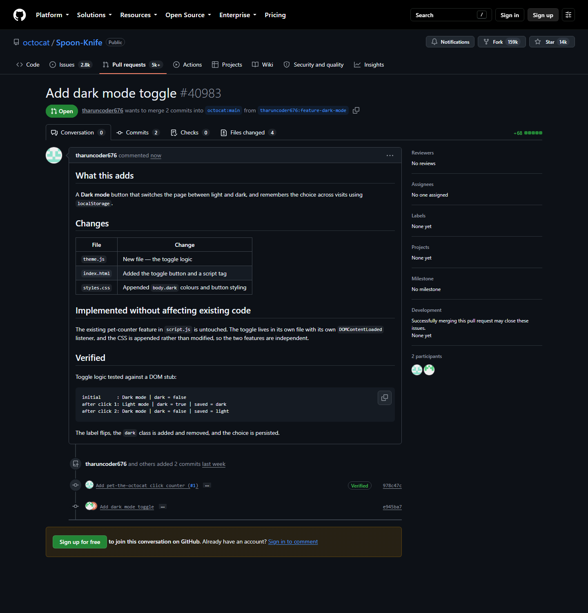

# Experiment 30 — Fork, Feature Branch and Pull Request to the Original Repository

## Links

| | |
|---|---|
| **Original repository** | https://github.com/octocat/Spoon-Knife |
| **My fork** | https://github.com/tharuncoder676/Spoon-Knife |
| **Pull request** | https://github.com/octocat/Spoon-Knife/pull/40983 |

---

## Aim

To fork someone else's repository, fetch the latest changes, create a feature
branch, implement a feature without affecting the existing code, push it to the
fork, and submit a pull request back to the original repository.

---

## Screenshots

### 1. Forked repository



The fork under my account, showing *forked from octocat/Spoon-Knife*.

### 2. Feature branch pushed to the fork



The `feature-dark-mode` branch on my fork, with the new `theme.js` file.

### 3. Pull request to the original repository



Pull request #40983 — *wants to merge 2 commits into `octocat:main` from
`tharuncoder676:feature-dark-mode`*. Note the base is **octocat**, not my own
fork, which is what makes this a cross-fork pull request.

---

## Steps Performed

### 1. Fork a repository

Forked `octocat/Spoon-Knife` — GitHub's official repository for practising this
exact workflow — to `tharuncoder676/Spoon-Knife`.

### 2. Fetch the latest changes

```bash
gh repo sync tharuncoder676/Spoon-Knife
```

### 3. Clone the fork to the local machine

```bash
git clone https://github.com/tharuncoder676/Spoon-Knife.git
cd Spoon-Knife
git remote add upstream https://github.com/octocat/Spoon-Knife.git
```

```
origin    https://github.com/tharuncoder676/Spoon-Knife.git (fetch)
origin    https://github.com/tharuncoder676/Spoon-Knife.git (push)
upstream  https://github.com/octocat/Spoon-Knife.git (fetch)
upstream  https://github.com/octocat/Spoon-Knife.git (push)
```

**Two remotes matter here:**

- `origin` — my fork, where I push
- `upstream` — the original repository, where I pull the team's latest changes from

```bash
git fetch upstream
```

### 4. Create a new branch for the feature

```bash
git checkout -b feature-dark-mode
```

### 5. Implement the feature

Added a **dark mode toggle**: a button that switches the page between light and
dark and remembers the choice in `localStorage`.

| File | Change |
|---|---|
| `theme.js` | **New file** — the toggle logic (included in this folder) |
| `index.html` | Added the toggle button and a `<script>` tag |
| `styles.css` | **Appended** `body.dark` colours and button styling |

**Without affecting the existing code.** The repository already had a
pet-counter feature in `script.js`. Rather than editing it, the toggle was put
in its own file with its own `DOMContentLoaded` listener, and the CSS was
appended rather than rewritten. The two features never touch each other, so the
existing behaviour cannot break.

**Verified before committing** — the toggle logic was run against a DOM stub:

```
initial      : Dark mode | dark = false
after click 1: Light mode | dark = true | saved = dark
after click 2: Dark mode | dark = false | saved = light
```

The label flips, the `dark` class is added and removed, and the choice persists.

### 6. Push to the forked repository

```bash
git add index.html styles.css theme.js
git commit -m "Add dark mode toggle"
git push -u origin feature-dark-mode
```

```
 * [new branch]      feature-dark-mode -> feature-dark-mode
```

Note this pushes to **`origin`** (my fork). I have no write access to the
original repository — which is exactly why the fork workflow exists.

### 7. Submit a pull request to the original repository

```bash
gh pr create --repo octocat/Spoon-Knife \
             --base main \
             --head tharuncoder676:feature-dark-mode \
             --title "Add dark mode toggle"
```

```
https://github.com/octocat/Spoon-Knife/pull/40983
```

The `--head tharuncoder676:feature-dark-mode` syntax — `owner:branch` — is what
tells GitHub the source branch lives on a different repository.

---

## Commands Used

| Command | Purpose |
|---|---|
| `gh repo sync <fork>` | Bring the fork up to date with the original |
| `git clone <fork-url>` | Copy the fork to the local machine |
| `git remote add upstream <original-url>` | Track the original repository as well |
| `git fetch upstream` | Fetch the latest changes from the original |
| `git checkout -b feature-dark-mode` | Create the feature branch |
| `git push -u origin feature-dark-mode` | Push the branch to **my fork** |
| `gh pr create --repo <original> --head <owner>:<branch>` | Open a pull request against the original |

---

## Why Fork Instead of Branch Directly?

On a repository you own, a branch is enough. On someone else's repository you
have no write access, so you cannot push a branch to it at all.

Forking gives you your own full copy that you *can* push to. The pull request
then asks the original maintainer to pull your branch across from your fork
into theirs. The maintainer keeps control of what enters their project, while
anyone can still propose a change — this is how open source contribution works.

---

## Note

`octocat/Spoon-Knife` is GitHub's official demonstration repository, created
specifically for practising the fork-and-pull-request workflow. Pull requests
opened against it are left open by design and are not merged, so the pull
request above will remain in the **Open** state — that is the expected result,
not a failure.
